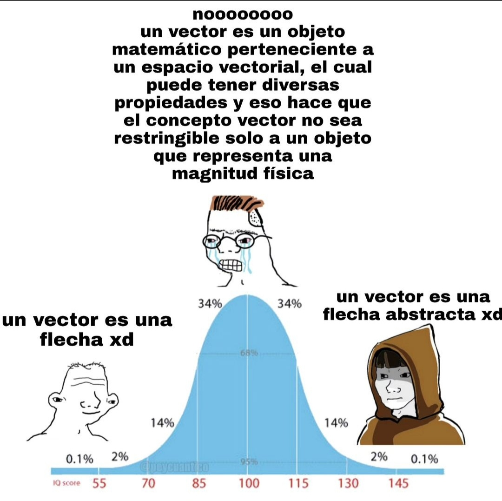

import LatexInline from "../../components/LatexInline.astro"

{/*  */}

{/* Animación recta real, puntos en ella y punto q se mueve con flecha apuntando */}

Imaginemos la recta de números reales como un conjunto de puntos donde cada número representa una posición. Podemos pensar en un **número** como una cierta cantidad de _pasos_ en una dirección particular teniendo al cero como **referencia**. Por ejemplo en este caso podemos imaginar un número como **$n$** _pasos_ a la derecha o a la izquierda del cero.

**El plano.**

{/* Generar el plano, escribimos _$\mathbb{R}^{2}$_, ponemos ejes y resaltamos el Origen */}

Cuando llevamos este concepto a dos dimensiones, obtenemos el **plano** (también conocido como **<LatexInline formula={"\\\mathbb{R}^{2}"}/>**). El cual es simplemente una superficie plana con dos rectas perpendiculares que se _cortan_ en el punto 0 del plano, al cual se le llama el _**origen**_ y se representa con la letra **$O$**. Al igual que en la recta real donde el 0 era nuestro punto de _referencia_, en el plano el origen 