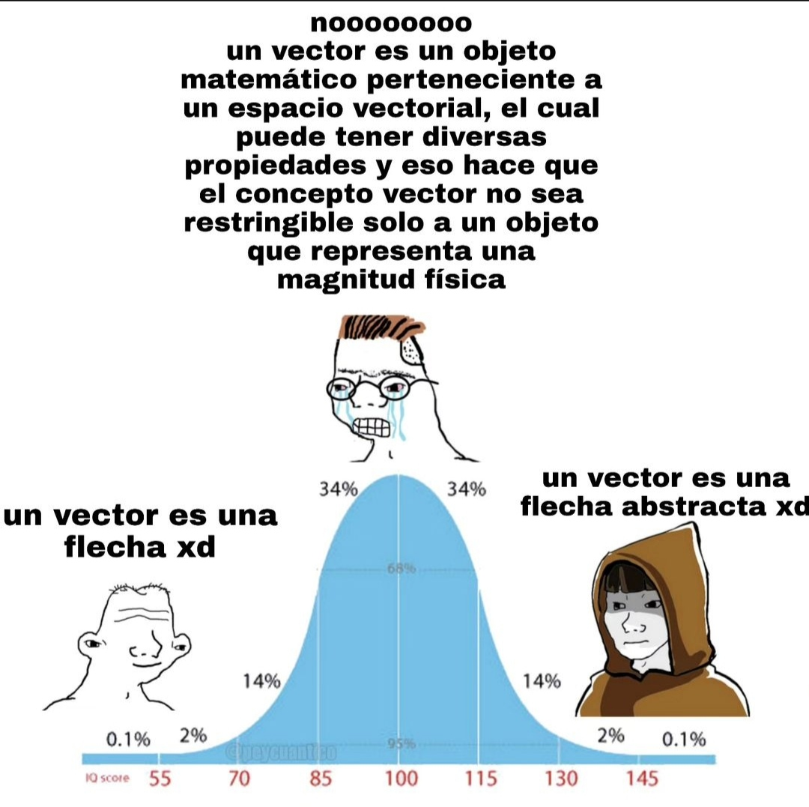

{/* temas: [
    "La recta numérica y el plano cartesiano.",
    "Puntos, sistema de coordenadas como pasos",
    "Que es un vector y algunas caracteristicas imoprtantes"
]*/}

Imaginemos la recta de números reales como un conjunto de puntos donde cada número representa una posición. Podemos pensar en un **número** como una cierta cantidad de _pasos_ en una dirección particular teniendo al cero como **referencia**. Por ejemplo en este caso podemos imaginar un número como **$n$** _pasos_ a la derecha o a la izquierda del cero.

**El plano.**

Cuando llevamos este concepto a dos dimensiones, obtenemos el **plano** (también conocido como **$\mathbb{R}^{2}$**). El cual es simplemente una superficie plana con dos rectas perpendiculares que se _cortan_ en el punto 0 del plano, al cual se le llama el _**origen**_ y se representa con la letra **$O$**. Al igual que en la recta real donde el 0 era nuestro punto de _referencia_, en el plano el origen **$\vec{O}$** se convierte en nuestro punto de **referencia**.
 
Una de las rectas la trazamos horizontalmente y la otra verticalmente. La recta horizontal la llamamos _**eje X**_ y la orientamos positivamente hacia la _derecha_, a la recta vertical la llamamos _**eje Y**_ y la orientamos positivamente hacia _arriba_.

### Que es un vector?
---

**Puntos en el plano.**

Al igual que en la recta, en el plano tambien podemos ubicar un punto dependiendo de su **posición** con respecto al _cero_, solo que ahora se necesitan dos números para ubicarlo.

En el plano, representamos un punto como una _pareja ordenada de numeros_, podemos entender esto como **coordenadas**, es decir, dos números que indican cuántos _pasos_ se dan en el eje X y en el eje Y. En este caso 2 _pasos_ a la derecha y 1 hacia arriba. El punto resultante se escribe con sus _coordenadas_ en orden de esta manera: $\begin{pmatrix} 3 \\ 2 \end{pmatrix}$

> Estas coordenadas se escriben en un orden específico, donde va primero la cantidad de _pasos_ en el eje X y luego la cantidad de _pasos_ en el eje Y. Lo que representa esta **pareja ordenada de números** es lo que llamamos un **punto** en el plano: $\begin{pmatrix} x \\ y \end{pmatrix}$

**Vectores en el plano.**

Un vector **no** lo mismo que un punto. Un punto simplemente representa una ubicación fija en el plano, mientras que un vector puede visualizarse como una flecha que parte desde el origen y se extiende hasta un punto específico en el plano, apuntando en esa **direccion**.

> Los vectores tienen una **dirección**, y eso es lo que los diferencia de los puntos. Los vectores siempre siguen la dirección _hacia donde apuntan_, es decir, hacia donde se extienden, yendo desde el origen hasta el punto donde terminan.

- Por ejemplo el vector $\begin{bmatrix} 3 \\ 2 \end{bmatrix}$ parte desde el origen hasta el punto $\begin{pmatrix} 3 \\ 2 \end{pmatrix}$ y sigue esa direccion.

Las componentes de un vector son los pasos que se dan en cada eje desde el origen para llegar a un punto específico en el plano, en este caso $\begin{bmatrix} 3 \\ 2 \end{bmatrix}$ la _componente_ en X del vector es 2, y la _componente_ en Y es 1.

- Un vector importante en el plano es el **origen** (**$\vec{O}$**), tambien conocido como el vector nulo, y es el vector con coordenadas $\begin{bmatrix} 0 \\ 0 \end{bmatrix}$, es decir 0 _pasos_ en el eje X y 0 _pasos_ en eje Y.

Los vectores son los objetos fundamentales con los que trabajaremos en este curso, y sus interpretaciones _abstractas_ las verán más adelante en álgebra lineal, pero de momento los veremos desde un punto de vista más _geométrico_ y visual.

> **Nota:** La manera en la que intento explicar el concepto de vector es una manera muy intuitiva y trato de evitar el uso de términos y conceptos matemáticos formales. Así que si desean una definición más profunda, aquí tienen un meme que lo explica. :D

